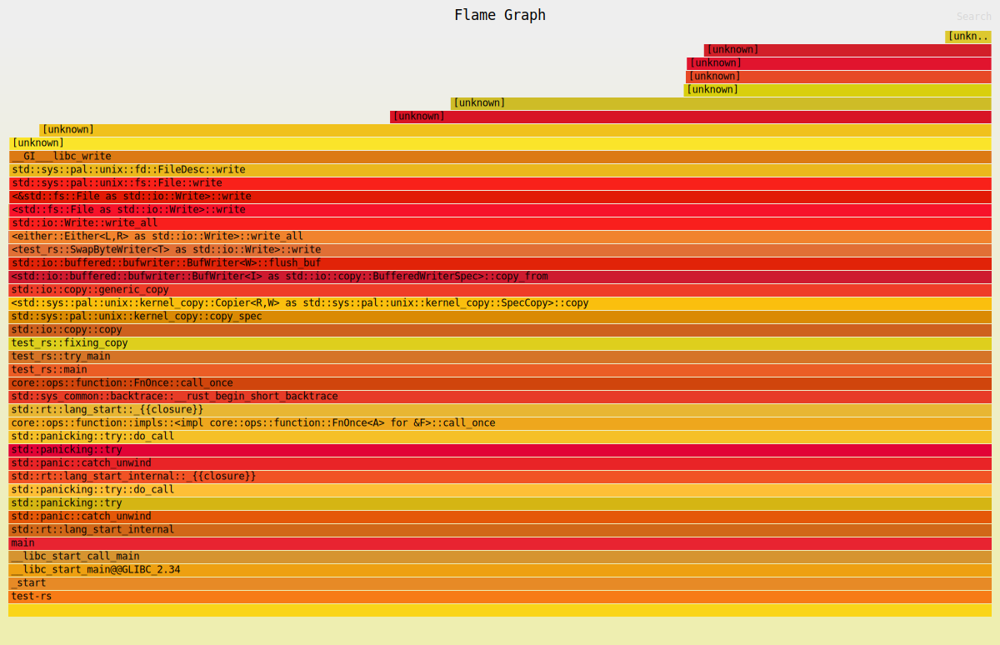
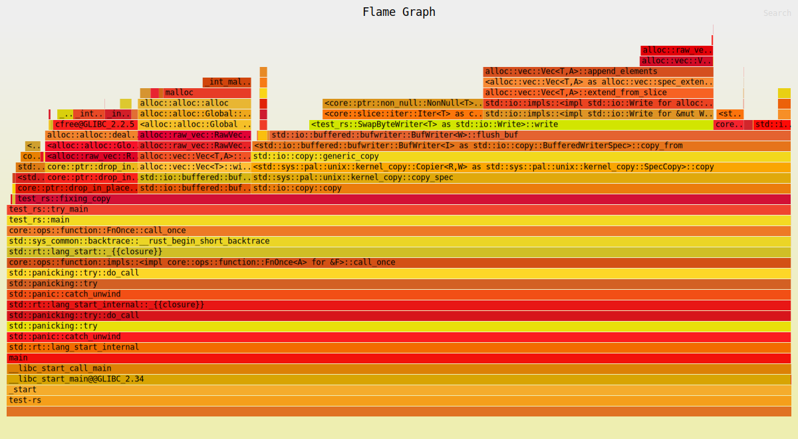

# Zelis Code Test (Rust)
---
You are given a large JSON file, ````data/test.json````. The file has been delivered by the client corrupt and is unable to be processed normally. After some inspection, you realize that at least one ````:```` has been mistyped as ````;```` within the file. The file must be processed by the end of the day and it is not feasible for the client to correct. Write a program that solves this problem.

- The program should take input from STDIN and write output to STDOUT.
- Optionally, the program can take ````--input```` and ````--output```` parameters, specifying file locations.
- Correct output will be valid JSON.
- Given a known schema, you can be confident that ````;```` does not exist within any valid input. As such, it's safe to simply replace them without concern for having accidentally replaced a valid character.
- This is a common problem that we've seen before and we will need to be able to use the program again on files much larger than the example, including files that are larger than the system's available memory.
- The primary goal is performance. The process will have to be run frequently for years to come, so it is important that it be as efficient as possible. It also needs to finish in time on short notice.

Create a new repository implementing your solution. When complete, share with ````@jgmartin```` and ````@waysidekoi```` for review. Thanks and good luck!

## Post-optimization results

I am now bottlenecked on my SSD's read speed, which is around 7200MB/s. For
details, see the following commits:

* [3d1881fe](https://github.com/CobaltCause/zelis-test-rs/commit/3d1881fe9ed6bbdbe0a727f5112268dfa85ff136)
* [54e0e1b3](https://github.com/CobaltCause/zelis-test-rs/commit/54e0e1b386bfe840351feb4e3d53cdabc3183eae)

## Pre-optimization results

### `time`

This command:

```bash
cargo build --quiet --release && /usr/bin/env time target/release/test-rs \
  < data/test.json \
  > /dev/null
```

outputs:

```
6.01user 1.21system 0:07.25elapsed 99%CPU (0avgtext+0avgdata 2108maxresident)k
0inputs+0outputs (0major+106minor)pagefaults 0swaps
```

which tells us that it had a high-water-mark of 2108KiB of memory, which in
turn tells us that it is not loading the entire dataset into memory to do its
transformations. It also tells us it took 7.25 seconds to run, which works out
around 145MB/s, which isn't too bad.

### Flamegraphs

The main function to pay attention to in these flamegraphs is called
`<test_rs::SwapByteWriter<T> as std::io::Write>::write`.

The first flamegraph, generated by running the program for real on the
`data/test.json` dataset, seems to indicate that most of the time is spent doing
IO rather than transformations on the data itself:



The second flamegraph, generated by running a modified version of the program
that only operates on in-memory data, also seems to suggest the overhead is
quite small:



Both flamegraphs were generated by the following command:

```bash
CARGO_PROFILE_RELEASE_DEBUG=true cargo flamegraph -- \
  --input data/test.json \
  --output /dev/null
```

However, the in memory flamegraph changed the `main` function to look like this:

```rust
let input = b"ioaenstioas;ahioenasiboyash;neoyaspynqkashioe;ashiboenasht;;";
let input_len = input.len();
let mut output = Vec::with_capacity(input_len);

for _ in 0..100_000_000 {
    let input = Cursor::new(input);

    fixing_copy(input, &mut output)?;

    std::hint::black_box(&mut output);

    output.clear();
}

Ok(())
```

### Comparison to `dd`

`dd` obviously won't be doing the transformations, but it can give us an upper
limit on our expectations for throughput. Here's read speed:

```console
$ dd if=data/test.json of=/dev/null status=progress
1031696896 bytes (1.0 GB, 984 MiB) copied, 1 s, 1.0 GB/s
2048159+1 records in
2048159+1 records out
1048657567 bytes (1.0 GB, 1000 MiB) copied, 1.01646 s, 1.0 GB/s
```

And read and write speed:

```console
$ dd if=data/test.json of=test-file status=progress
790160896 bytes (790 MB, 754 MiB) copied, 2 s, 395 MB/s
2048159+1 records in
2048159+1 records out
1048657567 bytes (1.0 GB, 1000 MiB) copied, 2.64959 s, 396 MB/s
```

So there's potentially still some optimizations to be had, but it might be a
pretty deep investigation to find out what exactly those optimizations are,
if any.
